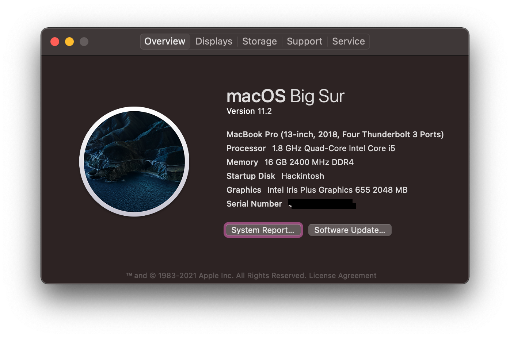
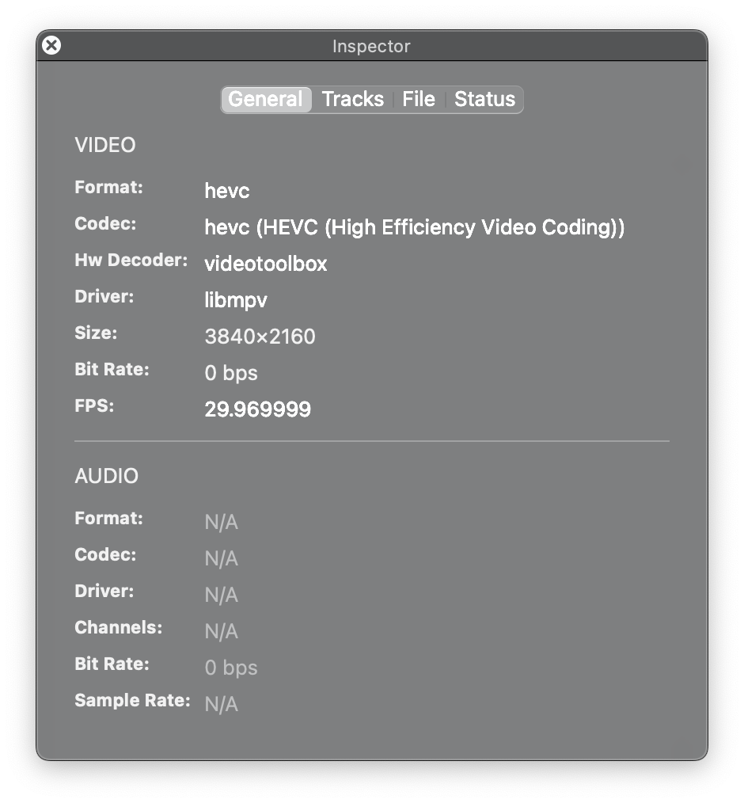
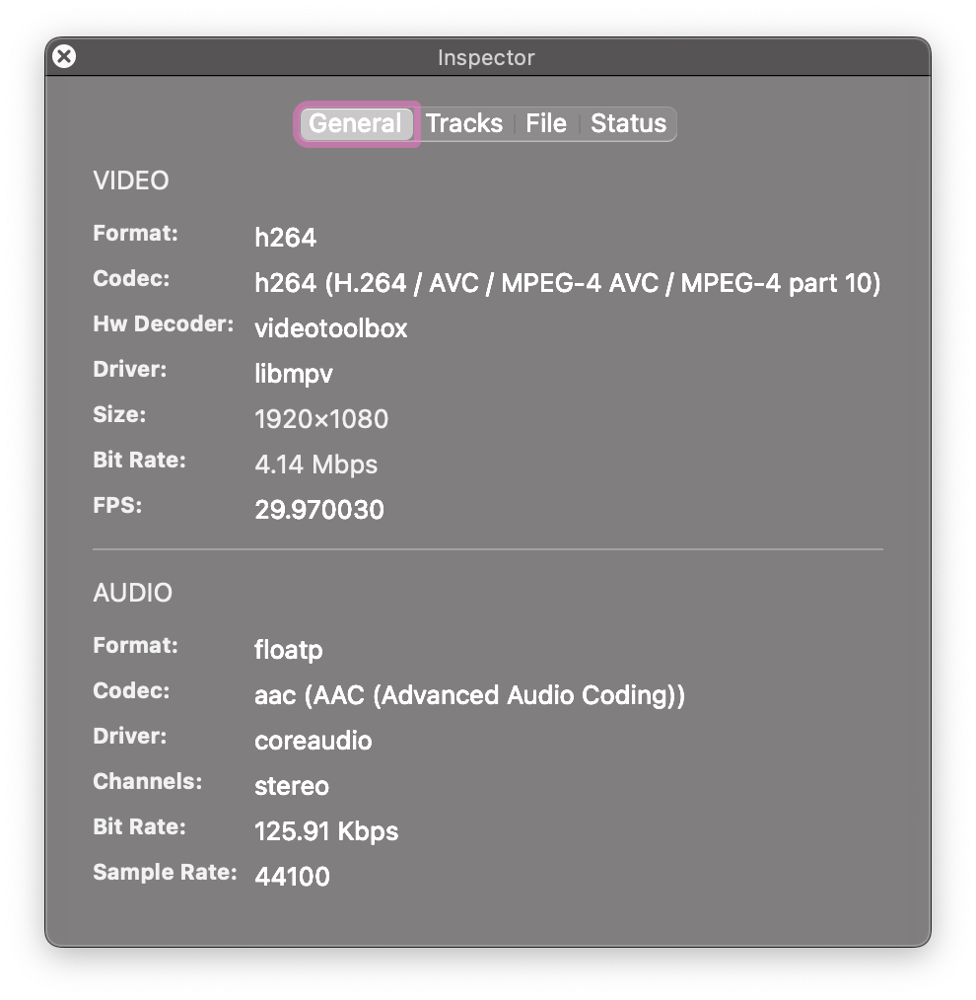

# LG-gram-14z990

Hackintosh macOS on LG Gram14 Z990

本Clover EFI修改自[capricornlee](https://github.com/capricornlee/LG-Gram13-Z990) 

本OpenCore EFI修改自[YJack007](http://bbs.pcbeta.com/viewthread-1876088-1-1.html) 

**注**：以下内容仅针对OpenCore，Clover已停止维护。

## 配置

|      | 详情   |
| ---- | -----------------------------------------|
| 型号 | LG Gram14 Z990|
| CPU  | Core i5-8265U|
| 显卡 | Intel UHD Graphics 620（Whiskey Lake）|
| 内存 | 8G板载+8G|
| 硬盘 | 已更换为西数蓝盘 SN550 1TB|
| 声卡 | Conexant CX8200|
| 网卡 | BCM94360CS2（占用一个M.2口）|
| 蓝牙 | Intel AC-9560|

## 工作情况
- [x] 声卡（扬声器，3.5mm耳机）
- [x] 显卡（HEVC+H.264 4K双硬解；HDMI输出最高2K@60）
- [x] Wi-Fi（博通网卡）/Intel蓝牙（Airdrop；Handoff）
- [x] 电源（电量显示；原生电源管理；CPU变频；睡眠一晚掉电1%）
- [ ] 键盘（Fn功能键未修复，F8 F10 F11 F12可正常使用）
- [x] 触控板
- [x] USB定制
- [x] iServices
- [ ] Thunderbolt 3 (没有设备且很可能导致睡眠问题)
- [ ] Card reader

## 使用

**1** 修改 BIOS 设定 (开机时按下F2进入 BIOS 后，Ctrl + Alt + F7 开启 BIOS 隐藏选项，感谢 **@as695336480** 提供[方法](https://github.com/capricornlee/LG-Gram13-Z990/issues/7#issue-624133249)）
1. BIOS-Main-Boot Features: **CMS Support [No]**, **Fast Boot [Disabled]** 
2. BIOS-Advanced-Intel Advanced Menu-Power&Performance-CPU Power Management Control: **CFG Lock [Disabled]** 
3. BIOS-Advanced-System Agent(SA) Configuration: **VT-d [Disabled]**,  **Above 4GB MMIO BIOS assignment [Enabled]** 
4. BIOS-Advanced-System Agent(SA) Configuration-Graphics Configuration: **DVMT Pre-Allocated [64M]**
5. BIOS-Advanced-Platform Settings: **System Time and Alarm Sourse [Legacy RTC]**
 
**2** 对BIOS进行适当的设置后，填入合适的三码，将EFI文件夹复制到[macOS安装器](https://support.apple.com/zh-cn/HT201372)的EFI分区即可直接安装。具体步骤请自行寻找教程。

**3** 建议的设置
1. 使用[one-key-hidpi](https://github.com/xzhih/one-key-hidpi)，推荐注入1424×802防止花屏；
2. System Perferences-Battery-Power Adapter: **Put hard disk to sleep when possible [Disabled]**
3. 自己重新定制USB
4. 使用[karabiner](https://karabiner-elements.pqrs.org)设置快捷键（如果有朋友愿意定制Fn快捷键请加油！）
5. 为了更好地引导Windows，强烈建议使用本机真实UUID作为OC的UUID。

## 更新记录

### 2021.2.6

* OC6.4 稳定，可以引导macOS 11.2和Windows 10 双系统，支持Boot Camp切换系统 ~~（win10 尚未测试）~~
* 当前除Fn快捷键 ~~和未测试的引导win 10~~ 外未发现其他问题
* 感谢**YJack007**在远景论坛提供的[OC引导配置](http://bbs.pcbeta.com/viewthread-1876088-1-1.html)，为我省去了很多麻烦。

### 2020.11.5
* OC6.3 基本稳定，可以引导macOS 10.15.7和win10
* 存在无法开启原生电源管理的问题，注入SSDT-PLUG会导致无法睡眠，待解决

### 2020.11.3
* 添加OC6.3启动，暂命名为OC β0.1 ~~（触控板无法使用，其他初步看来正常）~~ 似乎与Clover进度相同

## 参考

## 致謝

+ [capricornlee](https://github.com/capricornlee/LG-Gram13-Z990) CLOVER引导配置的基础。
+ [YJack007](http://bbs.pcbeta.com/viewthread-1876088-1-1.html) OC引导配置的基础。
+ [suzuke](https://github.com/suzuke/LG-Gram-13z980-Opencore) 提供了相当多的SSDT修正启发。
+ [OC-little](https://github.com/daliansky/OC-little) 提供了非常多SSDT修正的参考。
+ XStar-Dev的[电量修正教学](https://xstar-dev.github.io/hackintosh_advanced/Guide_For_Battery_Hotpatch.html)。
+ [神楽小白(GZ小白)](https://blog.gzxiaobai.cn/) 触控板驱动教学。
+ [黑果小兵](https://blog.gzxiaobai.cn/) 的诸多教学。
+ [Clover](https://sourceforge.net/projects/cloverefiboot/) 。
+ [acidanthera](https://github.com/acidanthera) Opencore团队。
+ [Apple](https://www.apple.com)的[macOS](https://www.apple.com.cn/macos/)系统.
+ 如有遗漏敬请见谅。
