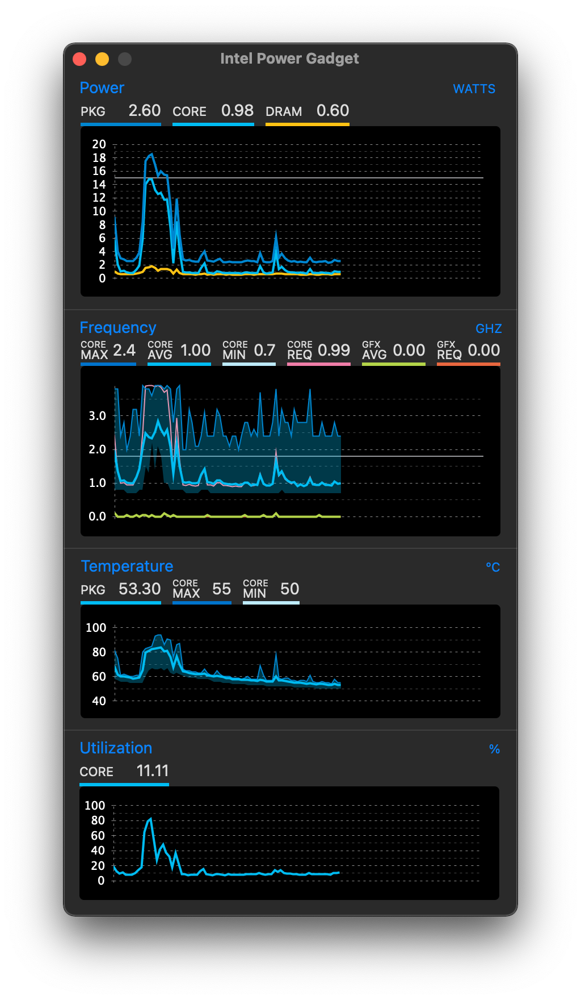

# LG-gram-14z990

Hackintosh MacOS on LG Gram14 Z990
本Clover EFI修改自[capricornlee](https://github.com/capricornlee/LG-Gram13-Z990)

## 配置

|      | 详情   |
| ---- | -----------------------------------------|
| 型号 | LG Gram14 Z990|
| CPU  | Core i5-8265U|
| 显卡 | Intel UHD Graphics 620（Whiskey Lake）|
| 内存 | 8G板载+8G|
| 硬盘 | 已更换为西数蓝盘 SN550 1TB|
| 声卡 | Conexant CX8200|
| 网卡 | 已替换为 BCM94360CS2（占用一个M.2口）|
| 蓝牙 | Intel AC-9560|

## 使用

**1** 修改 BIOS 设定 (开机时按下F2进入 BIOS 后，Ctrl + Alt + F7 开启 BIOS 隐藏选项，感谢 **@as695336480** 提供[方法](https://github.com/capricornlee/LG-Gram13-Z990/issues/7#issue-624133249)）
1. BIOS-Main-Boot Features: **CMS Support [No]**, **Fast Boot [Disabled]** 
2. BIOS-Advanced-Intel Advanced Menu-Power&Performance-CPU Power Management Control: **CFG Lock [Disabled]** 
3. BIOS-Advanced-System Agent(SA) Configuration: **VT-d [Disabled]**,  **Above 4GB MMIO BIOS assignment [Enabled]** 
4. BIOS-Advanced-System Agent(SA) Configuration-Graphics Configuration: **DVMT Pre-Allocated [64M]**
5. BIOS-Advanced-Platform Settings: **System Time and Alarm Sourse [Legacy RTC]**
 
**2** 对BIOS进行适当的设置后，填入合适的三码，将EFI文件夹复制到[macOS安装器](https://support.apple.com/zh-cn/HT201372)的EFI分区即可直接安装。具体步骤请查阅其他Clover教程。

## 驱动完善

- [x] 显卡：仿冒id：0x3E9B0000
  - 快捷键F2、F3调节亮度；
  - HiDPI用one-key-hidpi，推荐注入1424×802防止花屏；
  - HDMI输出正常（没有注入HDMI2.0，防止使用hdmi连接4K屏幕时默认输出4k@60导致黑屏，可以用RDM/EasyRes更改输出分辨率及频率）；
  - Thunderbolt 3 输出视频未测试；
  
- [x] 声卡：注入id：21，fn+F11、F12调节声音正常，耳机孔正常

- [x] 蓝牙：两种方案，用Intel或者BCM的都可以，BCM要额外占用一个USB口，我选择了用Intel
  - Intel的蓝牙驱动在远景论坛上[qcwap2012大佬](http://bbs.pcbeta.com/forum.php?mod=viewthread&tid=1838959&highlight=Intel%C0%B6%D1%C0)做出来了，放到驱动文件夹就好；（罗技低功耗蓝牙鼠标基本用不了，蓝牙耳机无法开启话筒，除非从Windows重启进macOS）
  - bcm的免驱但是需要自己走线，占用一个USB口
  
- [x] 网卡：Intel可以驱动但尚未完善，无法启用系统内建的Wi-Fi开关，装BCM免驱卡，买m.2 Mkey转接卡占用一个硬盘口。

- [x] 电池：正常显示电量，提取DSDT修改，参考RehabMan大神的教程
  - 电池用量正常；
  - 电源管理正常
  - 出现合盖仅关闭屏幕而不睡眠的问题，待解决
  - 其他如手动进入睡眠、开盖唤醒、键盘唤醒正常；
  
- [x] 键盘正常
  - 键盘Fn键没有修复，仅Fn+F4、Fn+F8、Fn+F10、Fn+F11、Fn+F12可以正常使用，（可以在设置中将F2、F3设置成亮度调节）

- [x] I2C触摸板：使用轮询模式，未来应该会修改为中断模式
  - 原理：可以直接用轮询模式
  - 受[suzuke](https://github.com/suzuke/LG-Gram-13z980-Opencore)启发使用SSDT禁用TPD0，新创建一个TPXX设备在macOS中使用

- [x] 雷电3：能驱动，不过没有设备测试热插拔，平时只用来充电

- [x] USB：最好自行定制一下USB端口

- [x] SD读卡器可以驱动（有时在睡眠唤醒后无法使用，重启即可）。

## 更新记录

### 2020.11.3
* 添加OC6.3启动，暂命名为OC β0.1（触控板无法使用，其他初步看来正常）

## 参考

## 致謝

+ [suzuke](https://github.com/suzuke/LG-Gram-13z980-Opencore) 本EFI的基础。
+ [OC-little](https://github.com/daliansky/OC-little) 提供了非常多SSDT修正的参考。
+ XStar-Dev的[电量修正教学](https://xstar-dev.github.io/hackintosh_advanced/Guide_For_Battery_Hotpatch.html)。
+ [神楽小白(GZ小白)](https://blog.gzxiaobai.cn/) 触控板驱动教学。
+ [黑果小兵](https://blog.gzxiaobai.cn/)的诸多教学。
+ [Clover](https://sourceforge.net/projects/cloverefiboot/) 。
+ 最后当然还要感谢[Apple](https://www.apple.com)的[macOS](https://www.apple.com.cn/macos/)系统.
+ 如有遗漏敬请见谅。
